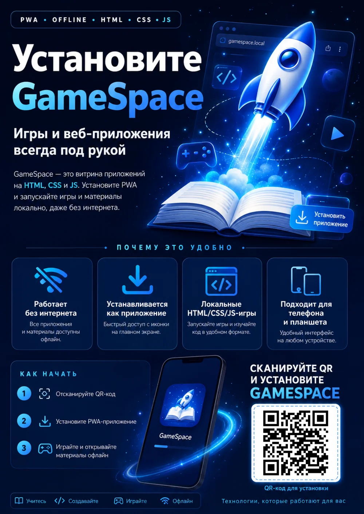
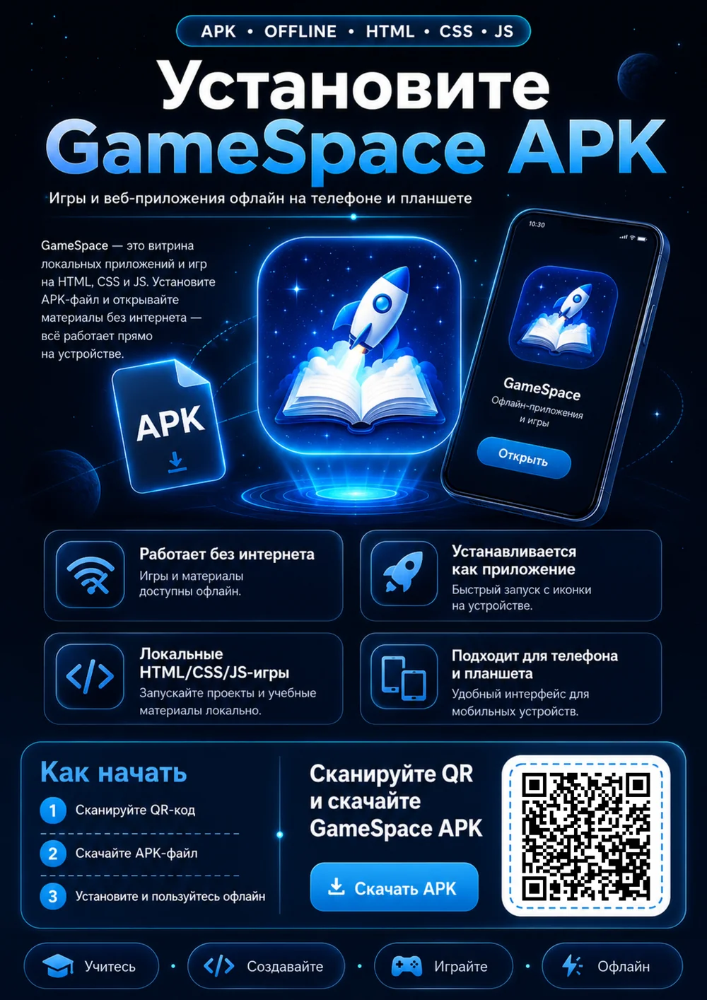
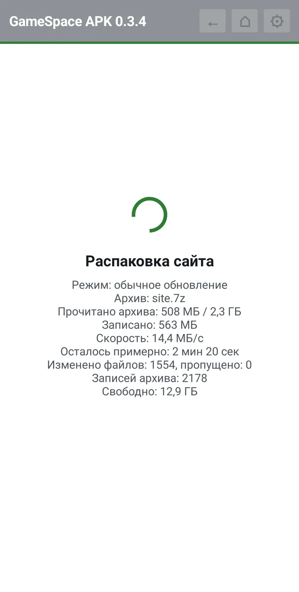
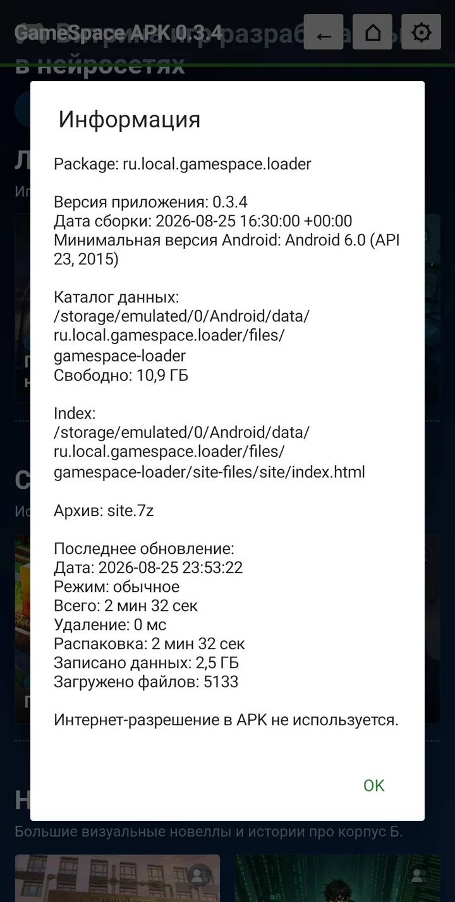

# GameSpace

<p align="center">
  <a href="https://ilyabarilo.github.io/gamespace/"></a>
  <a href="https://github.com/IlyaBarilo/gamespace/releases/latest/download/GameSpace-latest.apk"></a>
</p>
<p align="center">
  <a href="https://github.com/IlyaBarilo/gamespace/releases/latest"></a>
  <a href="LICENSE"></a>
  <a href="https://github.com/IlyaBarilo/gamespace/actions/workflows/ci.yml"></a>
</p>

[Установить PWA](https://ilyabarilo.github.io/gamespace/) ·
[Установить APK](https://github.com/IlyaBarilo/gamespace/releases/latest/download/GameSpace-latest.apk) ·
[Кейс разработки](docs/CASE_STUDY_RU.md) ·
[Проверенные устройства](docs/TESTED_DEVICES_RU.md) ·
[Постеры A4](#постеры-a4) ·
[Документация PWA](pwa-gamespace/README.md)

GameSpace запускает локальный HTML/CSS/JavaScript-сайт из архива на планшете
или телефоне без постоянного подключения к интернету и локальной сети.


*На иллюстрации показан интерфейс GameSpace PWA и APK версии 0.3.4.*

Автор: [Илья Барило (Ilya Barilo)](https://barilo.ru)

> **Статус:** GameSpace APK в основном завершён и поддерживается по мере
> необходимости. GameSpace PWA — текущее направление разработки. Для
> стабильного использования предназначены опубликованные релизы; ветка `main`
> может содержать изменения, ещё не вошедшие в выпуск.

## Что это за проект

GameSpace представлен двумя приложениями с общим назначением и единым форматом
исходного архива:

- **GameSpace PWA** устанавливается с сайта на домашний экран Android,
  iPhone или iPad без магазина приложений;
- **GameSpace APK** устанавливается на Android как отдельное приложение
  WebView.

Пользователь выбирает архив через системный файловый диалог. Архив читается на
самом устройстве, распаковывается в хранилище приложения и не отправляется на
сервер. После установки содержимого исходный архив можно отключить вместе с
флешкой или SD-картой: рабочая копия сайта уже находится на устройстве.

## Для кого

- для интерактивных игр, выставок и музейных стендов;
- для учебных и просветительских проектов;
- для планшетов в аудиториях и общественных пространствах;
- для автономных HTML-сайтов, каталогов и презентаций;
- для случаев, когда во время работы нет интернета и локальной сети.

## Какой вариант выбрать

| | GameSpace PWA | GameSpace APK |
|---|---|---|
| Платформы | Android, iPhone и iPad с необходимыми возможностями браузера | Android 6.0 и новее |
| Установка | С HTTPS-сайта на домашний экран, без магазина приложений | Из файла `GameSpace.apk` с разрешением Android на установку |
| Хранилище сайта | Закрытое хранилище браузера OPFS | Каталог данных Android-приложения |
| Обновление приложения | Только по явной команде пользователя из меню | Установкой новой версии APK |
| Основное преимущество | Одна веб-версия для iOS и Android без магазина | Более предсказуемая среда Android WebView и хранилища приложения |

Функциональность APK и PWA поддерживается максимально близкой, насколько это
позволяют ограничения Android, iOS и браузеров. Изменения формата архива не
должны требовать подготовки разных пакетов для двух приложений.

Фактические результаты ручных проверок PWA и APK приведены в
[матрице проверенных устройств](docs/TESTED_DEVICES_RU.md).

## Быстрый старт

### PWA

1. Откройте [страницу GameSpace PWA](https://ilyabarilo.github.io/gamespace/)
   по HTTPS.
2. Установите приложение кнопкой на странице или через меню браузера. На
   iPhone и iPad используйте Safari: **Поделиться → На экран «Домой»**.
3. Запустите установленный GameSpace и выберите встроенный демо-сайт или
   собственный архив через системный файловый диалог.

Первое открытие и установка PWA требуют интернета. После подготовки оболочки и
импорта сайта приложение работает автономно.

### APK

1. Скачайте готовый
   [`GameSpace-latest.apk`](https://github.com/IlyaBarilo/gamespace/releases/latest/download/GameSpace-latest.apk)
   или выберите другую версию в [GitHub Releases](https://github.com/IlyaBarilo/gamespace/releases).
2. Разрешите Android установку APK из используемого источника и установите
   приложение.
3. Запустите встроенный демо-сайт или выберите собственный архив через
   системный файловый менеджер Android.

Разрешение Android `INTERNET` в APK не добавлено: установленный сайт работает
полностью локально.

Подробная [инструкция для APK](apk-gamespace/README_APK.md) описывает установку,
форматы архивов, обновление содержимого и сборку из исходников.

Подробнее о двух вариантах содержимого рассказано в разделе
[«Встроенное демо или свой архив»](#встроенное-демо-или-свой-архив).

## Постеры A4

Постеры с QR-кодами для установки GameSpace PWA и APK. Нажмите на изображение,
чтобы открыть WebP для печати: 2480 × 3508 пикселей (300 dpi на A4). Выберите
бумагу A4, книжную ориентацию и вписывание изображения в страницу.

<table>
  <tr>
    <td align="center">
      <a href="docs/images/gamespace-poster-pwa-a4.webp"></a>
      <br><a href="docs/images/gamespace-poster-pwa-a4.webp"><strong>PWA — полный постер A4</strong></a>
    </td>
    <td align="center">
      <a href="docs/images/gamespace-poster-apk-a4.webp"></a>
      <br><a href="docs/images/gamespace-poster-apk-a4.webp"><strong>APK — полный постер A4</strong></a>
    </td>
  </tr>
</table>

## Возможности

- встроенный демонстрационный сайт для первой проверки;
- основной формат архива 7z, а также поддержка ZIP и ZIP64;
- выбор файла из памяти устройства и доступных системному диалогу флешек и
  SD-карт;
- полная установка или замена сайта;
- локальные update-архивы для быстрого обновления отдельных файлов;
- отображение прогресса и проверка свободного места;
- безопасная проверка путей внутри архива;
- запуск HTML, CSS, JavaScript, изображений, шрифтов, аудио, видео и сложных
  интерактивных сцен, включая 3D/360° в пределах доступных устройству веб-API;
- автономная работа после установки приложения и импорта содержимого.

PWA дополнительно использует отдельные ревизии, журнал операции и откат, чтобы
ошибка или прерывание обновления не повредили ранее установленный сайт.

## Сложные локальные проекты и 360°

GameSpace может запускать не только каталоги и небольшие игры, но и более
сложные локальные HTML/CSS/JavaScript-приложения. В PWA проверена виртуальная
экскурсия с интерактивным обзором и переходами между 360°-сценами в
3D-пространстве.

<table>
  <tr>
    <td align="center">
      <a href="docs/images/pwa-3d-entry.webp"></a>
      <br><strong>Интерактивный обзор</strong>
    </td>
    <td align="center">
      <a href="docs/images/pwa-3d-corridor.webp"></a>
      <br><strong>Навигация между сценами</strong>
    </td>
  </tr>
</table>

Доступные веб-API, производительность и объём памяти зависят от браузера,
Android WebView и конкретного устройства.

### Если импортированная игра стала работать иначе

Поведение HTML/CSS/JavaScript-игры может измениться после обновления браузерного
движка, даже если архив игры не менялся. В меню GameSpace можно посмотреть
текущий браузер и историю 20 последних замеченных периодов его версий. Одинаковая
версия не создаёт запись при каждом запуске: обновляется только время её
последнего использования.

Для независимой проверки совместимости на Android используйте две контрольные
среды: Chrome (Chromium) и Firefox (Gecko). Установите GameSpace PWA через меню
второго браузера, импортируйте тот же архив и сравните работу конкретной игры.
Эти браузеры названы как фактически проверяемые представители разных движков,
а не как рекомендация производителя. Другие поддерживаемые браузеры также могут
работать. Сохраните исходную установку до окончания проверки.

Для ручной установки на Android откройте меню браузера и выберите «Установить
приложение». На iPhone и iPad откройте «Поделиться» и выберите «На экран Домой».

Каждый браузер использует собственное закрытое хранилище. Импортированный сайт,
сохранения игр, настройки и история версий между установками не переносятся;
архив нужно выбрать заново. На iPhone и iPad установка через другой браузер
обычно не даёт такого же независимого сравнения движков, поскольку браузеры
используют системные возможности WebKit.

## Формат архива

Основной вариант — один цельный незашифрованный файл `.7z`. ZIP и ZIP64
поддерживаются для совместимости и локальных обновлений. Зашифрованные и
многотомные архивы не поддерживаются.

Импортированный сайт может содержать произвольный JavaScript. Используйте
архивы только из доверенного источника; границы проверки и хранения описаны в
[`SECURITY.md`](SECURITY.md).

Допустимы три структуры:

```text
site.7z
  site/
    index.html
```

```text
site.7z
  index.html
```

```text
site.7z
  one-folder/
    index.html
```

Внутренние ссылки сайта должны быть относительными и не должны зависеть от
внешнего сервера. Регистр букв в путях следует соблюдать: `Logo.webp` и
`logo.webp` могут считаться разными файлами.

## Большие архивы

В GameSpace нет программного ограничения архива. PWA обрабатывает 7z
диапазонами в отдельном Worker и записывает распакованные данные непосредственно
в OPFS; ZIP/ZIP64 также распаковывается последовательно. Полный архив и весь
сайт не должны одновременно помещаться в оперативную память.

Практический предел определяется:

- свободным местом на устройстве;
- размером распакованных файлов;
- квотой, предоставленной браузером для PWA;
- возможностями файлового провайдера и операционной системы;
- способностью устройства не выгружать длительную операцию из памяти.

В авторском испытании GameSpace PWA 0.3.4 на одном Android-устройстве 25 августа
2026 года успешно установила из 7z-архива 5 133 файла и записала 2,47 ГБ данных
за 9 минут 40 секунд. Это результат одного конкретного испытания, а не
гарантированный предел для всех устройств; [скриншоты и контекст приведены в
кейсе](docs/CASE_STUDY_RU.md#проверка-большого-архива-в-pwa).

<table>
  <tr>
    <td align="center">
      <a href="docs/images/pwa-large-progress.webp"></a>
      <br><strong>Распаковка</strong>
    </td>
    <td align="center">
      <a href="docs/images/pwa-large-ready.webp"></a>
      <br><strong>Сайт готов</strong>
    </td>
    <td align="center">
      <a href="docs/images/pwa-large-info.webp"></a>
      <br><strong>Сводка операции</strong>
    </td>
  </tr>
</table>

В отдельном испытании тот же файл `site.7z` был установлен в GameSpace APK
0.3.4. Во время распаковки APK показывала архив объёмом 2,3 ГБ, а итоговая
сводка зафиксировала 5 133 загруженных файла, 2,5 ГБ записанных данных и полную
установку за 2 минуты 32 секунды. Значения 2,47 ГБ в PWA и 2,5 ГБ в APK на
скриншотах версии 0.3.4 отличаются старым округлением APK; содержимое архива
одно и то же. В актуальной реализации обе версии после операции суммируют
размеры всех фактически установленных файлов и используют одинаковое
форматирование, поэтому этот сайт отображается как 2,47 ГБ и в PWA, и в APK.

<table>
  <tr>
    <td align="center">
      <a href="docs/images/apk-large-progress.webp"></a>
      <br><strong>APK: распаковка 2,3 ГБ</strong>
    </td>
    <td align="center">
      <a href="docs/images/apk-large-info.webp"></a>
      <br><strong>APK: итог установки</strong>
    </td>
  </tr>
</table>

Для полной установки PWA временно требуется место под действующую и новую
ревизии сайта вместе с резервом. Поэтому большие архивы нужно
проверять на конкретных моделях устройств; один общий гарантированный предел
для всех телефонов и планшетов указать нельзя.

## Автономность и обновления PWA

Обычный запуск установленной PWA использует последнюю полностью подготовленную
локальную оболочку и не загружает новую версию приложения, WebAssembly или
демо-архив. Проверка и установка функционального обновления выполняются только
по явной команде пользователя из меню.

Пользовательский сайт хранится отдельно от оболочки PWA. Неудачное обновление
оболочки не должно заменять ранее работавшую версию, а опубликованные выпуски
сохраняются как отдельные неизменяемые пакеты.

Удаление приложения или очистка его данных удаляет распакованный сайт. Исходный
архив следует сохранять отдельно.

## Встроенное демо или свой архив

Демо и собственный архив — альтернативы. Встроенное демо позволяет сразу
проверить GameSpace, но устанавливать его перед своим сайтом не требуется. В
обоих вариантах содержимое распаковывается в локальное хранилище приложения.

<table>
  <tr>
    <td align="center">
      <a href="docs/images/pwa-import.webp"></a>
      <br><strong>PWA: демо или архив</strong>
    </td>
    <td align="center">
      <a href="docs/images/apk-import.webp"></a>
      <br><strong>APK 0.3.4: демо или архив</strong>
    </td>
    <td align="center">
      <a href="docs/images/pwa-result.webp"></a>
      <br><strong>PWA 0.3.4: пример демо-игр</strong>
    </td>
  </tr>
</table>

Пятиэтапный сценарий установки PWA показан в
[кейсе разработки](docs/CASE_STUDY_RU.md#pwa-от-страницы-установки-до-локального-демо).

Исходные материалы встроенного демо находятся в [`demo/`](demo/). Файл
`demo.7z` не хранится в репозитории: сборщики APK и PWA создают и проверяют его
из этого каталога.

Официальный неизменённый GameSpace можно скачивать, устанавливать, использовать
и распространять вместе со встроенным демо, в том числе в вузе или другой
организации. В это же приложение можно импортировать собственный архив, оставив
демо доступным.

Демо-игры, страницы, изображения и другие оригинальные материалы нельзя
извлекать и включать в собственный архив, сайт, изменённую сборку или другой
проект. Полные условия приведены в
[`demo/DEMO_CONTENT_LICENSE.md`](demo/DEMO_CONTENT_LICENSE.md).

## Стабильные выпуски

[GitHub Releases](https://github.com/IlyaBarilo/gamespace/releases) является
источником стабильных версий APK и PWA. Установленная PWA не обновляется
автоматически: пользователь сам запускает проверку и установку новой версии.
Прошлые выпуски PWA остаются доступными для ручного возврата.

Подписанный APK сохраняется в Release под версионным именем и как идентичная
копия `GameSpace-latest.apk`. Постоянная ссылка
[на последний стабильный APK](https://github.com/IlyaBarilo/gamespace/releases/latest/download/GameSpace-latest.apk)
автоматически переходит к этому файлу в актуальном Release. `latest` не является
отдельной версией или тегом.

Подробный порядок подготовки версии и возврата к прошлому выпуску описан в
[`pwa-gamespace/RELEASING_RU.md`](pwa-gamespace/RELEASING_RU.md).

## Сборка из исходников

Для PWA требуются Node.js 20 или новее и 7-Zip:

```powershell
cd pwa-gamespace
npm install
npm run test
npm run build
```

Подробности: [`pwa-gamespace/README.md`](pwa-gamespace/README.md).

Для сборки APK на Windows:

```bat
apk-gamespace\build-apk.bat build
```

Команда создаёт локальный тестовый APK с отладочной подписью. Официальный APK
для GitHub Release собирается только с постоянным ключом из Actions Secrets.
Скрипт использует отдельное Android-окружение проекта. Требования, установка
SDK, подпись и результат сборки описаны в
[`apk-gamespace/README_APK.md`](apk-gamespace/README_APK.md).

## Структура репозитория

```text
apk-gamespace/   исходники и сборка Android-приложения
pwa-gamespace/   исходники, тесты и выпуск PWA
demo/            исходные материалы встроенного демо
docs/            документация, изображения интерфейса и постеры A4
third_party/     лицензии и исходные материалы сторонних компонентов
tools/           общие инструменты сборки
.github/         сборка и публикация стабильных выпусков GameSpace
```

## Лицензирование

Репозиторий содержит материалы с разными условиями использования. Корневая
MIT License является основной лицензией оригинального программного кода и
текстовой документации GameSpace, но не отменяет явно указанные условия для
отдельных материалов и сторонних компонентов.

| Материалы | Условия |
|---|---|
| Оригинальный программный код и текстовая документация GameSpace, если в конкретном файле не указано иное | [MIT License](LICENSE) |
| Оригинальные материалы встроенного демо | Только как встроенное демо неизменённого официального GameSpace; подробности в [DEMO_CONTENT_LICENSE.md](demo/DEMO_CONTENT_LICENSE.md) |
| Значок GameSpace и связанные фирменные графические материалы | Не входят в MIT; в изменённой версии должны быть заменены согласно [BRAND_ASSETS_LICENSE.md](BRAND_ASSETS_LICENSE.md) |
| Официальные изображения документации, постеры и социальная обложка | Разрешены только в неизменённом виде как часть официального репозитория, документации и презентационных материалов GameSpace; применяются условия для [фирменной графики](BRAND_ASSETS_LICENSE.md) и [демо-материалов](demo/DEMO_CONTENT_LICENSE.md) |
| Название и идентичность продукта GameSpace | MIT не предоставляет прав на товарный знак или фирменное обозначение |
| Сторонние компоненты | Сохраняют собственные лицензии из [THIRD_PARTY_NOTICES.md](THIRD_PARTY_NOTICES.md) и `third_party/licenses/` |

Таким образом, указание MIT относится к оригинальному программному коду и
текстовой документации GameSpace, а не автоматически ко всему содержимому
репозитория.

Готовый выпуск PWA включает этот комплект документов и тексты сторонних
лицензий непосредственно в пакет. В установленной PWA они доступны в разделе
`Лицензии`, а в APK — через пункт `⚙ → Лицензии`.
