# Кейс разработки GameSpace

[Открыть PWA](https://ilyabarilo.github.io/gamespace/) ·
[Скачать APK](https://github.com/IlyaBarilo/gamespace/releases/latest) ·
[Основная документация](../README.md)

GameSpace — два варианта одного продукта для установки и автономного запуска
локальных HTML/CSS/JavaScript-сайтов на телефоне или планшете. Пользователь
выбирает 7z- или ZIP-архив, приложение обрабатывает его на устройстве и хранит
рабочую копию сайта в собственном хранилище.

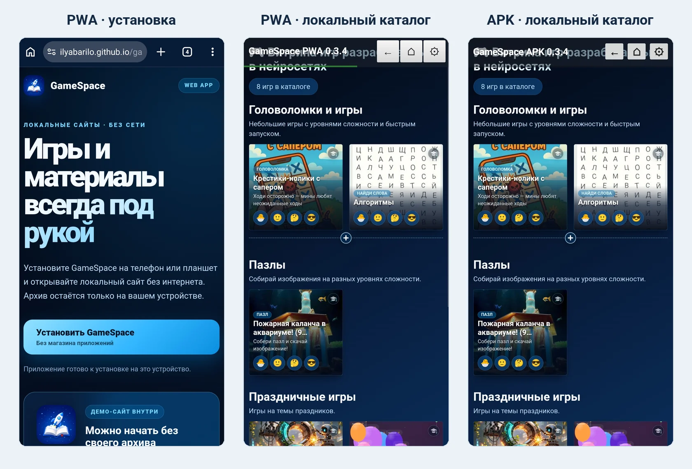

*На иллюстрации показан интерфейс GameSpace PWA и APK версии 0.3.4.*

## Исходная задача

Учебные игры, тесты, визуальные новеллы и другие HTML-проекты часто остаются
после завершения работы в отдельных каталогах. Чтобы повторно использовать их
на занятии, выставке, интерактивной панели или планшете, потребовалась единая
витрина, которая не зависит от постоянного доступа к интернету и локальной
сети.

Обычного копирования каталога на Android оказалось недостаточно: локальная
HTML-страница, открытая через системный файловый механизм, не всегда получает
предсказуемый доступ к соседним скриптам, стилям, изображениям и другим ресурсам.
Понадобилась оболочка, которая сама устанавливает содержимое и открывает его из
контролируемого локального хранилища.

## От монолитной сборки к сменному содержимому

Первое решение объединяло Android WebView-оболочку, витрину и содержимое в одном
APK. Такой вариант упрощал первоначальное развёртывание, но связывал выпуск
приложения с каждой заменой игр или материалов. По мере роста коллекции
пересборка и передача большого APK стали мешать обновлению содержимого.

В текущем поколении оболочка отделена от сайта:

- приложение устанавливается и обновляется самостоятельно;
- основной сайт передаётся отдельным локальным архивом;
- небольшие update-архивы могут заменять только изменившиеся файлы;
- исходный архив после импорта не нужен для обычного запуска;
- APK и PWA используют один контракт содержимого.

Это разделение превратило GameSpace из одноразовой сборки с фиксированной
витриной в инструмент для разных локальных сайтов.

## Почему основной формат — 7z

GameSpace поддерживает 7z, ZIP и ZIP64. ZIP удобен и широко распространён, но на
реальных наборах файлов встречаются архивы с неоднозначной кодировкой
кириллических имён. 7z хранит имена в Unicode более предсказуемо, поэтому выбран
основным форматом, хотя его обработка в PWA и Android сложнее.

Приложения принимают один цельный незашифрованный архив с `index.html` или
`index.htm`. Допустимые варианты структуры и ограничения описаны в
[основной документации](../README.md#формат-архива).

## Две реализации одного продукта

| | GameSpace PWA | GameSpace APK |
|---|---|---|
| Установка | С HTTPS-сайта на домашний экран поддерживаемого устройства | Из файла APK на Android |
| Хранилище сайта | Origin Private File System браузера | Каталог данных Android-приложения |
| Обработка архива | Последовательная запись в OPFS; 7z обрабатывается в отдельном Worker | Потоковое чтение через системный файловый диалог Android |
| Защита обновления | Новая ревизия, журнал операции и откат | Полное или быстрое локальное обновление |
| Сеть | Нужна для первого открытия и установки оболочки | Разрешение Android `INTERNET` не запрашивается |

PWA даёт вариант без магазина приложений для Android, iPhone и iPad, если
браузер предоставляет необходимые возможности. APK сохраняет более
предсказуемую среду Android WebView и хранилища приложения. Функциональность
вариантов поддерживается максимально близкой в пределах ограничений платформ.

## Сценарий на устройстве

### PWA: от страницы установки до локального демо

Встроенное демо и собственный архив — два альтернативных варианта первого
запуска. Демо позволяет быстро проверить приложение, но устанавливать его перед
выбором собственного архива не требуется.

<table>
  <tr>
    <td align="center">
      <a href="images/pwa-install-page.webp">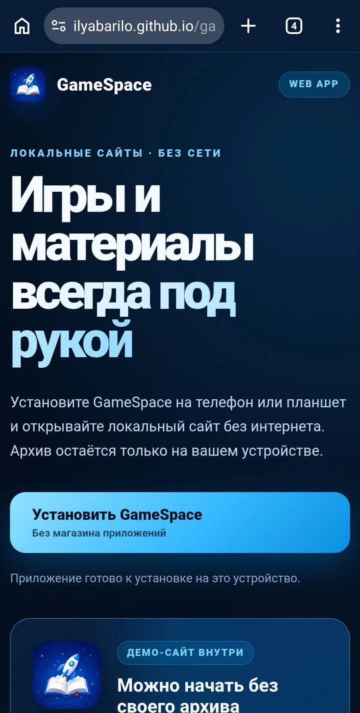</a>
       1. Открыть PWA
    </td>
    <td align="center">
      <a href="images/pwa-install-prompt.webp">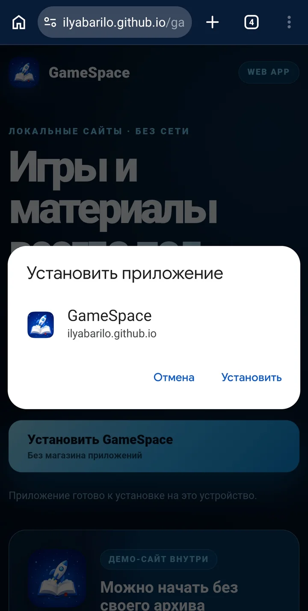</a>
       2. Установить
    </td>
    <td align="center">
      <a href="images/pwa-import.webp">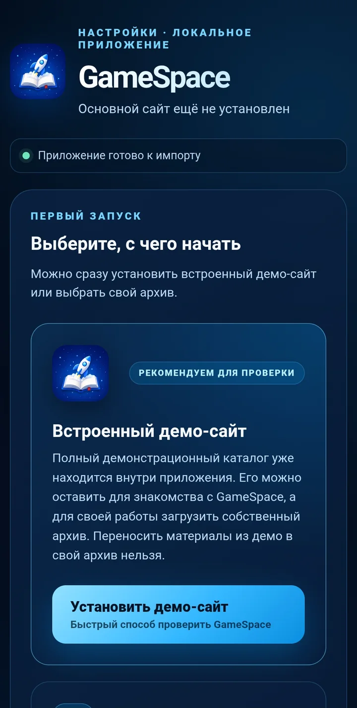</a>
       3. Выбрать содержимое
    </td>
    <td align="center">
      <a href="images/pwa-ready.webp">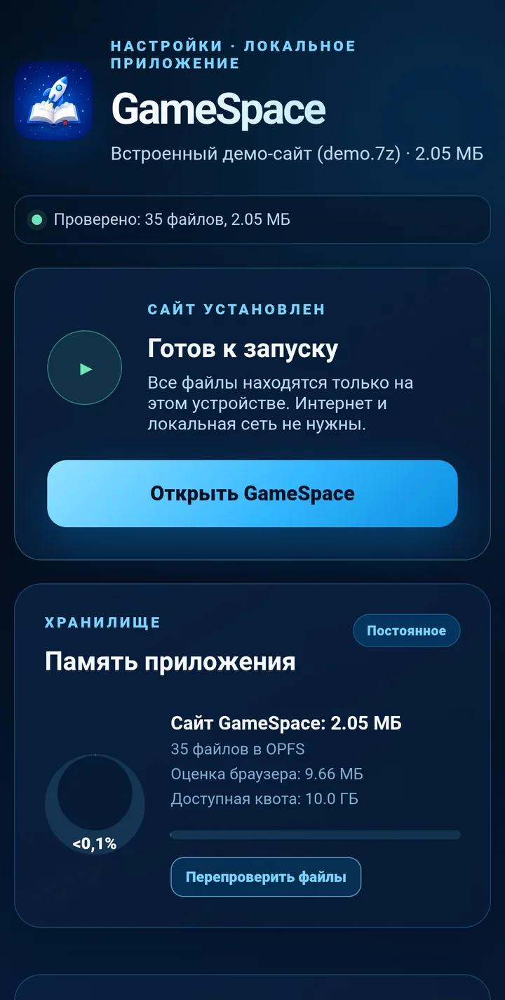</a>
       4. Дождаться готовности
    </td>
    <td align="center">
      <a href="images/pwa-result.webp">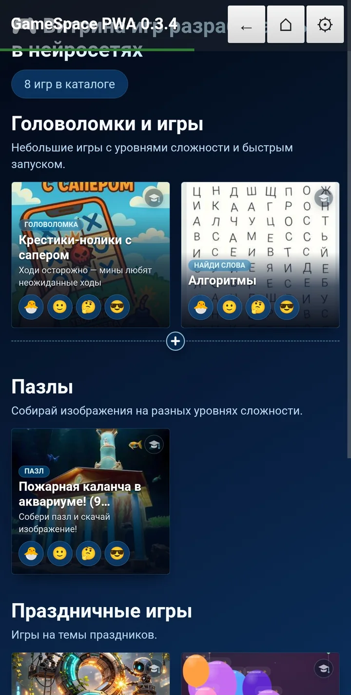</a>
       5. Открыть каталог (PWA 0.3.4)
    </td>
  </tr>
</table>

Все уменьшенные кадры открываются в полном размере. На них показан встроенный
демонстрационный сайт; при выборе собственного архива последующие этапы те же.

### Встроенное демо с примерами или свой архив

GameSpace можно начать использовать одним из двух способов: установить
встроенное демо с примерами игр и материалов либо сразу загрузить собственный
7z- или ZIP-архив. Демо помогает проверить приложение, но не является
обязательным этапом перед установкой своего сайта. Ниже эта возможность показана
на экранах GameSpace APK; в PWA доступен такой же выбор.

<table>
  <tr>
    <td align="center">
      <a href="images/apk-import.webp">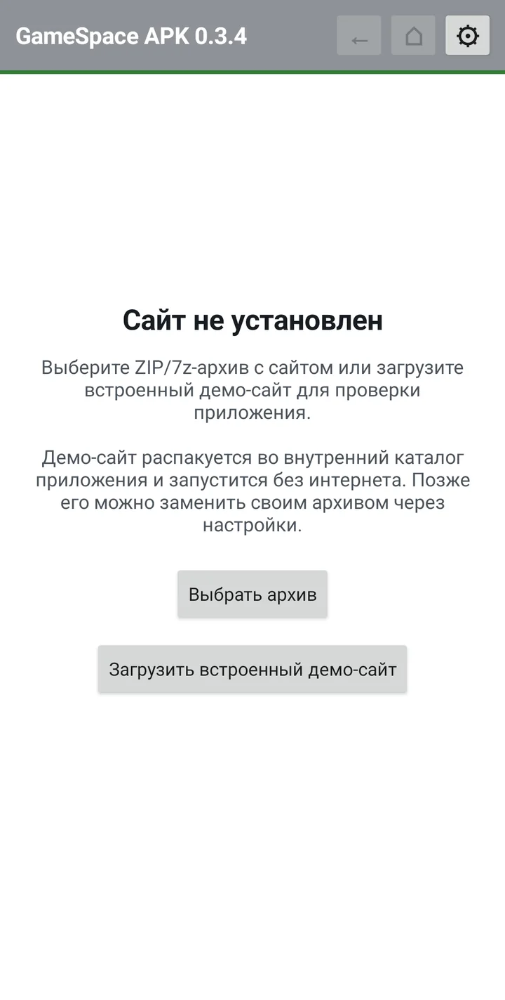</a>
       <strong>APK 0.3.4: демо или собственный архив</strong>
    </td>
    <td align="center">
      <a href="images/apk-catalog.webp">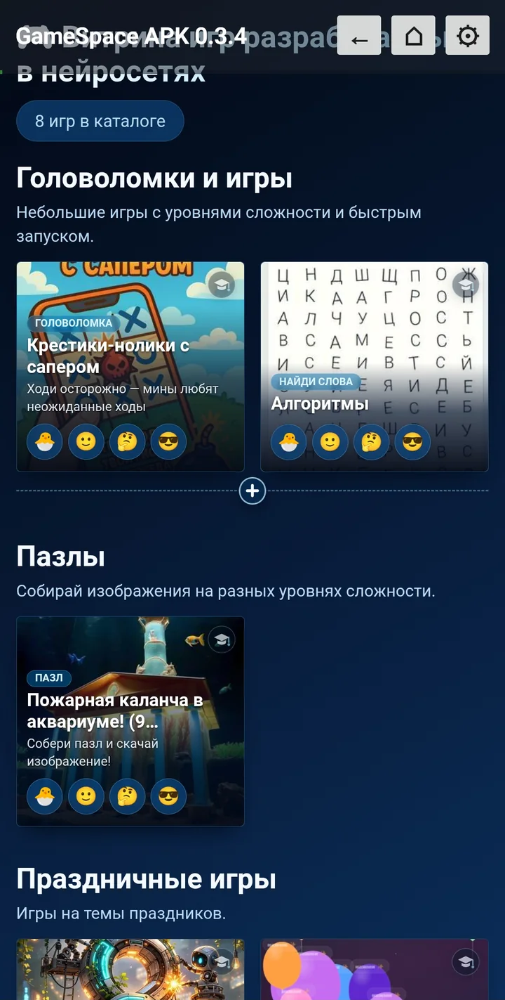</a>
       <strong>APK 0.3.4: примеры встроенного демо</strong>
    </td>
  </tr>
</table>

## Проверка большого архива в PWA

25 августа 2026 года автор проверил GameSpace PWA 0.3.4 на одном
Android-устройстве с 7z-архивом большого локального сайта. Интерфейс приложения
зафиксировал 5 133 обработанных файла, 2,47 ГБ записанных данных и завершение
полной установки за 9 минут 40 секунд.

<table>
  <tr>
    <td align="center">
      <a href="images/pwa-large-progress.webp">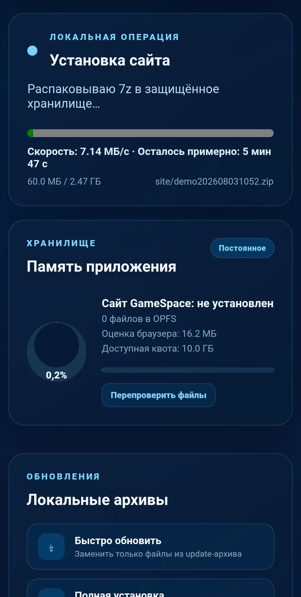</a>
       <strong>Распаковка</strong>
    </td>
    <td align="center">
      <a href="images/pwa-large-ready.webp">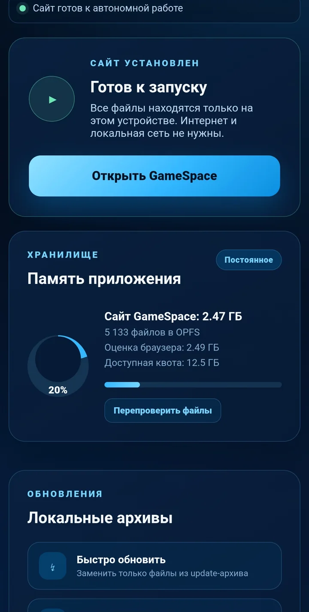</a>
       <strong>Сайт готов</strong>
    </td>
    <td align="center">
      <a href="images/pwa-large-info.webp">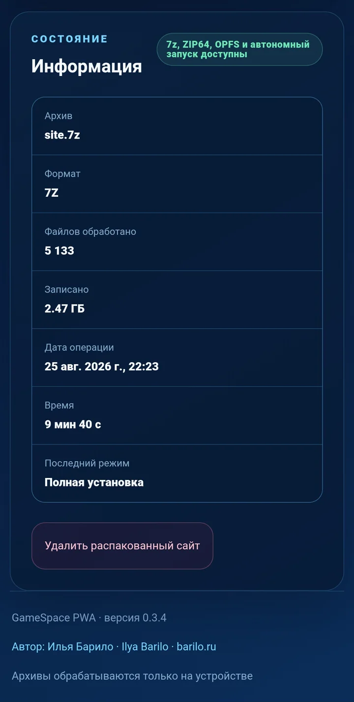</a>
       <strong>Сводка операции</strong>
    </td>
  </tr>
</table>

После установки PWA открыла расширенную локальную витрину с большим числом
карточек и разделов:

<table>
  <tr>
    <td align="center">
      
    </td>
    <td align="center">
      
    </td>
  </tr>
</table>

Этот результат подтверждает один конкретный сценарий, но не устанавливает общий
предел для других моделей, браузеров и архивов. Модель устройства, версия ОС и
браузера пока не занесены в публичную матрицу испытаний. Тот же большой архив
был установлен и в APK; скриншоты распаковки и итоговой сводки приведены в
[основной документации](../README.md#большие-архивы).

## Сложное содержимое: 3D и 360°

GameSpace не ограничивается каталогами и простыми страницами. Импортированный
сайт может использовать поддерживаемые браузером или Android WebView веб-API,
включая Canvas, WebGL и другие средства интерактивной графики. В PWA фактически
проверена локальная виртуальная экскурсия с интерактивным обзором и переходами
между 360°-сценами в 3D-пространстве:

<table>
  <tr>
    <td align="center">
      <a href="images/pwa-3d-entry.webp">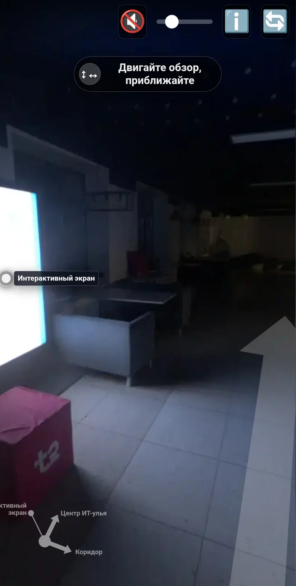</a>
       <strong>Интерактивный обзор</strong>
    </td>
    <td align="center">
      <a href="images/pwa-3d-corridor.webp">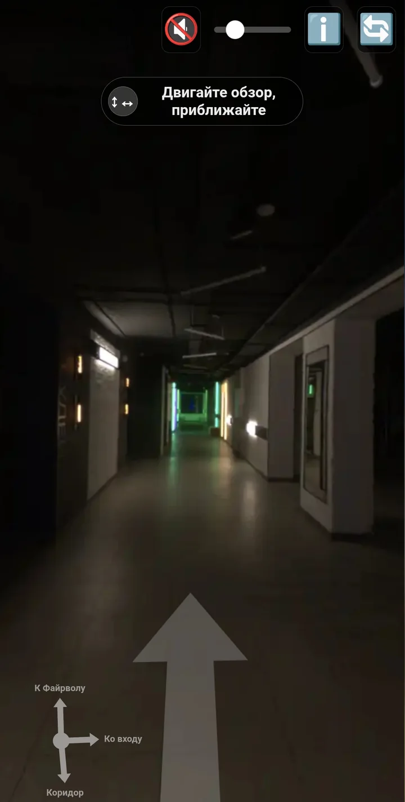</a>
       <strong>Навигация между сценами</strong>
    </td>
  </tr>
</table>

Конкретные возможности такого проекта зависят от веб-API, производительности и
памяти целевого устройства, но для GameSpace это остаётся обычным локальным
HTML/CSS/JavaScript-сайтом внутри того же формата архива.

## Проверяемые инженерные решения

Репозиторий содержит не только исходный код, но и проверки критичных контрактов:

- пути архива нормализуются, а абсолютные пути, `..`, пустые сегменты и
  конфликты отклоняются;
- PWA оценивает доступное хранилище, создаёт отдельные ревизии и сохраняет
  предыдущий рабочий сайт до успешного завершения замены;
- update-архив PWA применяется с журналом и откатом при ошибке;
- Service Worker закреплён за линией выпусков и не изменяется по тому же URL;
- CI выполняет тесты, собирает PWA на Linux и APK с одноразовой тестовой
  подписью на Windows, не публикуя результат проверки как релиз;
- стабильный выпуск получает одну общую версию PWA и APK.

Автоматические проверки не заменяют испытания на реальном устройстве. Размер
архива, время обработки и доступная квота зависят от модели, ОС, браузера,
свободного места и файлового провайдера. Поэтому GameSpace не заявляет единый
гарантированный предел для всех телефонов и планшетов.

## Роль генеративного ИИ

Генеративный ИИ использовался как инструмент итеративной разработки и анализа
вариантов: при подготовке и доработке отдельных участков кода, диагностике
ошибок, сравнении архитектурных решений, создании проверок и уточнении
документации.

Автор формулировал требования, принимал архитектурные решения, проверял код,
собирал приложения и тестировал их на целевых устройствах. Решения менялись по
результатам фактических проверок, а не принимались только на основании ответа
модели. GameSpace не позиционируется как пользовательский ИИ-продукт: ИИ был
частью процесса разработки, а не функцией приложения.

## Ограничения и выводы

Текущая архитектура не отменяет ограничений платформ:

- импортировать следует только архивы из доверенного источника;
- пользовательский HTML и JavaScript не становятся безопасными автоматически;
- данные PWA зависят от квоты и политики хранения браузера;
- удаление приложения или очистка его данных удаляет установленный сайт;
- большие архивы нужно проверять на конкретном целевом устройстве;
- совместимость следует подтверждать фактическими испытаниями, а не только
  наличием API в браузере или Android.

Подробная модель доверия приведена в [политике безопасности](../SECURITY.md).

Основные переносимые выводы проекта:

1. Содержимое, оболочка и версия продукта должны изменяться независимо.
2. Формат данных нужно выбирать по реальным файлам, включая кодировки и объём.
3. Безопасное обновление требует промежуточного состояния, проверки и способа
   восстановления.
4. Архитектурная возможность не равна подтверждённой совместимости на всех
   устройствах.
5. ИИ полезен внутри цикла «требование → реализация → проверка → новое
   ограничение», когда ответственность за результат остаётся у автора.
